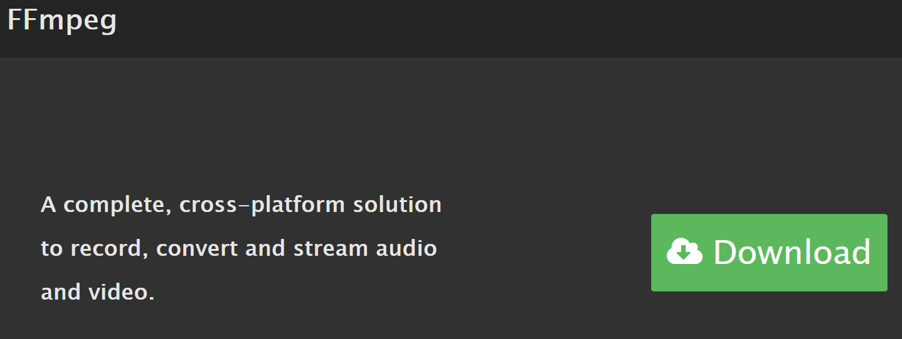
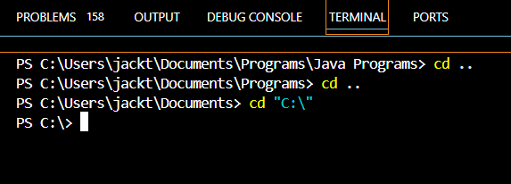

## How it works:
- This program takes a given M3U file on your local system and uses it to copy all of files specified within it to a given directory, while maintaining the 2 folder directory above the given file.

- For example if one file in the M3U was listed with directory "C:\Users\jackt\Music\Pink Floyd\Dark Side of the Moon\Money" it would recreate the directory hierarchy in the destination folder with "...\Destination Folder\Pink Floyd\Dark Side of the Moon\Money".

## What it needs to work:
- This program does utilize ffmpeg in order to change the file types from other audio file types to .mp3, so if you plan to use it with this implementation install ffmpeg using the following link:

### Links:

- [ffmpeg Installation](https://www.ffmpeg.org/)

- [A video guide if needed](https://youtu.be/eRZRXpzZfM4?si=RXmt3MCVXtapoUSj)

## How to run:
- In order to run this program you'll need to use Visual Studio Code or some other adjacent program. Once loaded the program itself should be able to run just by hitting run.

### Potential Issues
- Note that if you try to run it at a directory above "C:\" it wont be able to access the other elements as a side effect (for example if you are in "C:\Users\jackt\Documents\Programs" you won't be able to access any of the 
files outside of the Programs directory. So make sure that before you run the program go to the integrated terminal in VS Code where you are going to run the program and use the command `cd ..` or use `cd "C:\" to so that when running the program it'll have access to all files on that drive.

- Another thing to note is that you will have to write the file directory to the powershell program in order for it to run properly (don't forget to use quotation marks if one of the folders in the directory path has a space in it).
